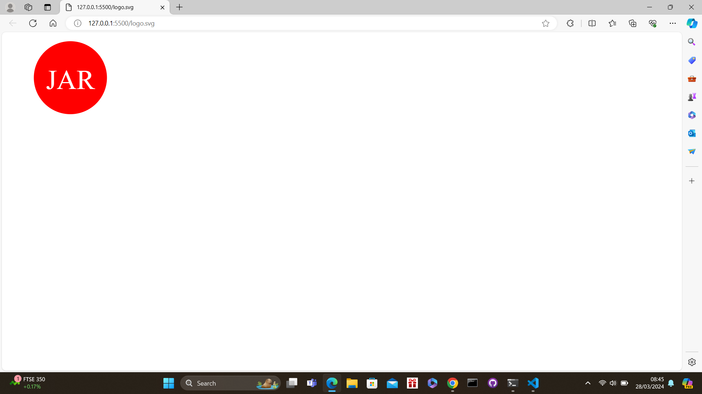

# 10th-Challenge-SVG-Logo_Maker

## What was my project and what have i been able to achieve?
In this project I was tasked with creating a fully functioning SVG Logo Maker which i have sucessfully been able to do by ensuring that when the user runs the "node index.js" request or the "npm run start" request they are then presented with a series of questions that allows them to enter a three word logo, the colour of the logo and text. They are also then presented with a list of three shapes "Circle, Square and Triangle" which affects what the logo shape will be.

When all of the prompts are answered an SVG file is then created which details all of your responses into creating a logo. In addition to that i have also ensured that when the user opens the logo in a browser they are then met with a logo that is a 300 x 200 pixel image

https://drive.google.com/file/d/1Z0-sa7gUxYhynasJVn1w2TcNG1vVk_LP/view

